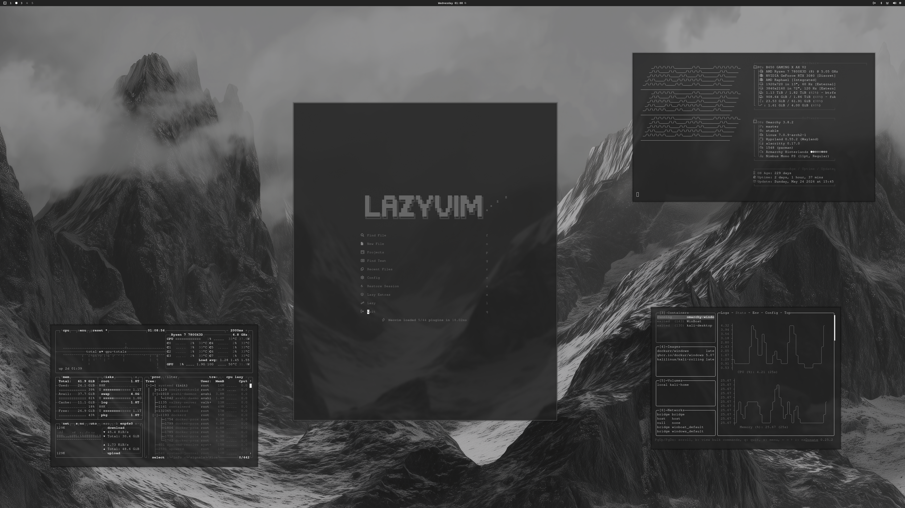

# Hinterlands Theme

Hinterlands is a monochrome, dark-mode theme inspired by foggy waterlines and distant silhouettes. Low-contrast layers and crisp highlights keep it calm and readable without breaking the grayscale mood.

This is a fork of [OldJobobo/omarchy-hinterlands-theme](https://github.com/OldJobobo/omarchy-hinterlands-theme) with reworked borders and shadows that are inverted from the original and toned down.

## Preview



## Install

```bash
omarchy-theme-install https://github.com/newone757/armarchy-hinterlands-theme
```

## Wallpapers

| | | |
| --- | --- | --- |
|  |  |  |
|  |  |  |
|  |  |  |
|  |  |  |
|  |  |  |
|  |  |  |
